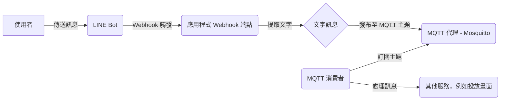

# 專案名稱

## 簡介

本專案是一個基於 MQTT 的訊息傳遞系統，主要用於處理 LINE Bot 接收到的使用者訊息，並將其轉發給後端的 MQTT 伺服器，以供其他服務使用。

## 架構



如上圖所示，系統主要由以下幾個部分組成：

1. **LINE Bot**: 作為使用者介面，接收使用者發送的訊息。
2. **Webhook 端點**: 由 `main.py` 實現，負責接收 LINE Bot 轉發的訊息。
3. **MQTT 代理**: 使用 Mosquitto 實現，負責訊息的中轉。
4. **MQTT 消費者**: 由 `mqtt/consumer.py` 實現，訂閱特定的 MQTT 主題，並處理接收到的訊息。
5. **其他服務**: 例如投放畫面，可以根據接收到的訊息進行相應的操作。

## 功能

*   **Webhook**: 應用程式提供一個 Webhook 端點 (`/webhook`)，用於接收 LINE Bot 轉發的使用者訊息。當使用者向 LINE Bot 發送訊息時，LINE 平台會將訊息以 POST 請求的形式發送到此端點。
*   **訊息提取**: Webhook 端點接收到訊息後，會從中提取出使用者發送的文字內容。
*   **MQTT 發布**: 應用程式將提取出的文字訊息發布到 MQTT 伺服器上的指定主題 (例如 `line/message`)。
*   **MQTT 訂閱**: 其他服務 (例如 `mqtt/consumer.py`) 可以訂閱該主題，以接收使用者發送的訊息。
*   **訊息處理**: 訂閱者接收到訊息後，可以根據自身的需求進行處理，例如將訊息顯示在畫面上。

## 檔案結構
```
.
├── Dockerfile
├── README.md
├── main.py
├── log_service.py
├── mqtt
│ ├── comsumer.py
│ └── publisher.py
├── mosquitto
│ └── config
│ └── mosquitto.conf
└── requirements.txt
```

*   **`main.py`**: 應用程式的主要入口，包含 Webhook 端點的實現。
*   **`log_service.py`**: 日誌記錄服務。
*   **`mqtt/comsumer.py`**: MQTT 消費者範例，用於訂閱主題並處理訊息。
*   **`mqtt/publisher.py`**: MQTT 發布者範例，用於發布訊息到指定主題。
*   **`mosquitto/config/mosquitto.conf`**: Mosquitto 代理的設定檔。
*   **`Dockerfile`**: Docker 映像檔的建構檔案。
*   **`requirements.txt`**: 專案依賴的 Python 套件列表。

## 安裝與設定

1. **安裝依賴**:

    ```bash
    pip install -r requirements.txt
    ```

2. **設定 Mosquitto**:

    修改 `mosquitto/config/mosquitto.conf` 檔案，配置 Mosquitto 代理的相關設定，例如監聽埠、使用者名稱密碼等。

3. **設定 LINE Bot**:

    在 LINE 開發者平台建立 LINE Bot，並設定 Webhook URL 為您的應用程式的 Webhook 端點 (例如 `https://your-domain.com/webhook`)。

4. **啟動服務**:

    *   **使用 Docker (建議)**:

        ```bash
        docker build -t line-mqtt .
        docker run -d -p 8080:8080 -p 1883:1883 line-mqtt
        ```

    *   **手動啟動**:

        ```bash
        # 啟動 Mosquitto 代理
        mosquitto -c mosquitto/config/mosquitto.conf

        # 啟動應用程式
        python main.py
        ```

## 使用方法

1. 使用者向 LINE Bot 發送訊息。
2. LINE 平台將訊息轉發到應用程式的 Webhook 端點。
3. 應用程式提取訊息中的文字內容，並將其發布到 MQTT 伺服器的指定主題。
4. 訂閱了該主題的其他服務會接收到訊息，並進行相應的處理。
